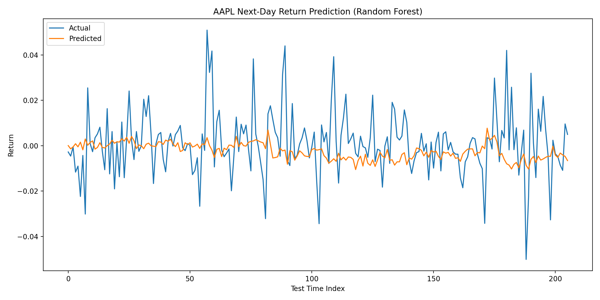
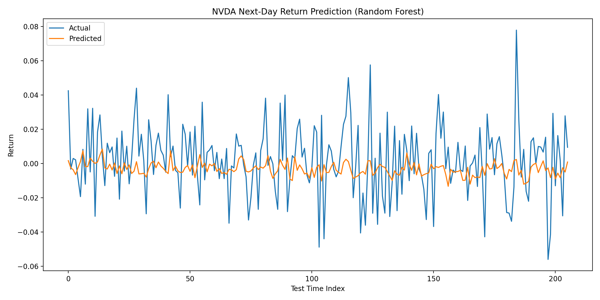
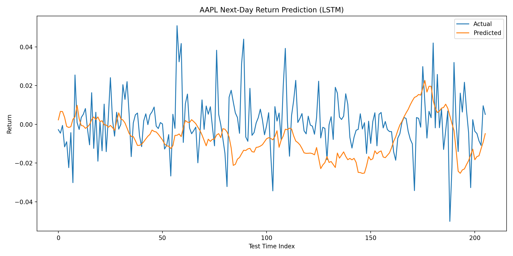
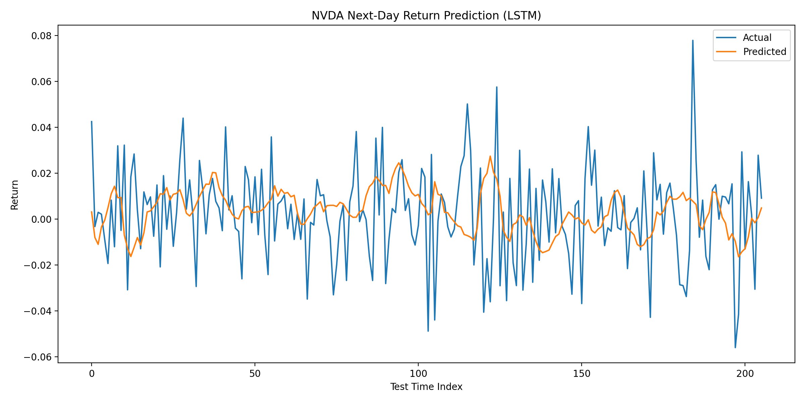
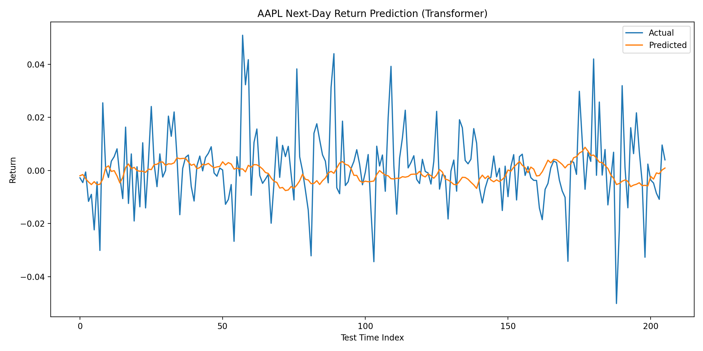
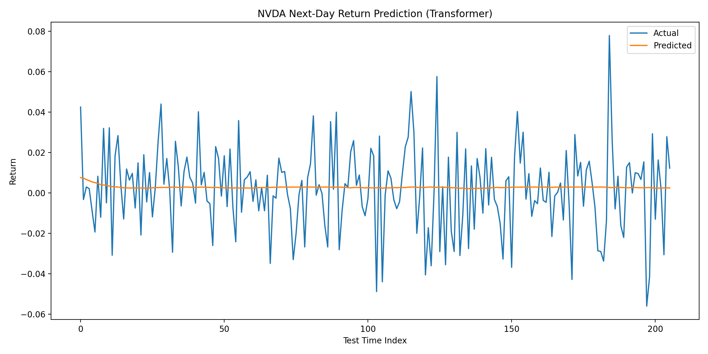

# ML-Based Stock Market Prediction Model

A comparative study of three machine learning architectures for next-day stock return prediction, built for CSE 185 at UC Santa Cruz.

## Overview

This project trains and evaluates **Random Forest**, **LSTM**, and **Transformer** models on historical equity data for Apple (AAPL) and NVIDIA (NVDA). All three models share a standardized 19-feature engineering pipeline to ensure fair architectural comparison. The goal is not to build a trading system, but to rigorously evaluate whether — and under what conditions — each architecture can predict short-term returns better than a naive baseline.

---

## Results

| Ticker | Model         | MAE     | Direction Accuracy | Baseline |
|--------|---------------|---------|--------------------|----------|
| AAPL   | Random Forest | 0.01037 | 52.91%             | 53.40%   |
| AAPL   | LSTM          | 0.01516 | 47.09%             | 53.40%   |
| AAPL   | Transformer   | 0.01015 | 50.97%             | 53.40%   |
| NVDA   | Random Forest | 0.01664 | 49.03%             | 44.66%   |
| NVDA   | LSTM          | 0.01753 | 51.94%             | 44.66%   |
| NVDA   | Transformer   | **0.01612** | **54.37%**     | 44.66%   |

- **Transformer** achieved the lowest MAE on both tickers and the highest directional accuracy on NVDA (+9.71pp above baseline)
- **AAPL** was resistant to prediction across all models — consistent with market efficiency for large-cap equities
- **NVDA's** higher volatility appears to create exploitable sequential patterns, especially for attention-based models

### Prediction Plots

| AAPL | NVDA |
|------|------|
|  |  |
|  |  |
|  |  |

---

## Features (19 standardized across all models)

| Category | Features |
|----------|----------|
| Lagged returns | `return_1`, `return_2`, `return_3`, `return_5` |
| Moving averages | `sma_5`, `sma_10`, `sma_20` |
| Rolling volatility | `vol_5`, `vol_10` |
| Momentum | `rsi_14` |
| Trend | `macd`, `macd_signal` |
| Volatility band | `bb_width` (Bollinger Band width) |
| Volume | `volume_change`, `volume_sma_10` |
| Market context | `spy_return_1`, `spy_vol_10`, `qqq_return_1`, `qqq_vol_10` |

---

## Models

### Random Forest
- 500 estimators, max depth 10, min 5 samples per leaf
- Walk-forward validation (rolling 50-day windows from 60% split)
- Feature importance saved per ticker

### LSTM
- Architecture: `LSTM(64) → Dropout(0.2) → LSTM(32) → Dropout(0.2) → Dense(1)`
- ~34,000 parameters
- Early stopping (patience=5, up to 50 epochs)
- Scaler fit on training data only to prevent leakage

### Transformer
- Sinusoidal positional encoding + 2 encoder blocks
- Multi-head attention (4 heads, d_model=64) + FFN (ff_dim=128)
- ~57,000 parameters
- Early stopping (patience=10, up to 100 epochs)

All models use a **20-day sliding window** for sequential input and a strict **80/20 chronological train/test split**.

---

## Project Structure

```
├── src/
│   ├── features.py                  # Shared feature engineering + data fetching
│   ├── transformer_model.py         # Transformer architecture
│   ├── aapl_random_forest_reg.py
│   ├── nvda_random_forest_reg.py
│   ├── aapl_lstm.py
│   ├── nvda_lstm.py
│   ├── aapl_transformer.py
│   └── nvda_transformer.py
├── outputs/
│   ├── *_predictions_plot.png       # Prediction plots (tracked)
│   ├── *_predictions.csv            # Prediction data (gitignored)
│   ├── *_feature_importances.csv    # RF feature importance (gitignored)
│   └── results_summary.csv          # All model metrics (gitignored)
├── .env.example
├── requirements.txt
└── README.md
```

---

## Setup

**1. Create virtual environment**
```bash
python3 -m venv .venv
source .venv/bin/activate
```

**2. Install dependencies**
```bash
pip install -r requirements.txt
```

**3. Configure API keys**
```bash
cp .env.example .env
```
Then add your Alpaca credentials to `.env`:
```
API_KEY=your_key
API_SECRET=your_secret
```

---

## Running

Run from the `src/` directory:

```bash
cd src

# Random Forest
python aapl_random_forest_reg.py
python nvda_random_forest_reg.py

# LSTM
python aapl_lstm.py
python nvda_lstm.py

# Transformer
python aapl_transformer.py
python nvda_transformer.py
```

Each script saves its plot to `outputs/`, its predictions CSV, and updates `outputs/results_summary.csv` with the latest MAE, direction accuracy, and baseline comparison.

---

## Data

- **Source:** Alpaca Markets API (IEX feed)
- **Range:** January 2022 – present
- **Tickers:** AAPL, NVDA (target), SPY, QQQ (market context)
- **Frequency:** Daily OHLCV bars

---

## Technologies

- Python 3.11+
- scikit-learn — Random Forest, StandardScaler, metrics
- TensorFlow / Keras — LSTM, Transformer
- alpaca-py — market data API
- pandas, numpy, matplotlib
- python-dotenv

---

## Author

Camille Yabu — Computer Engineering, UC Santa Cruz
